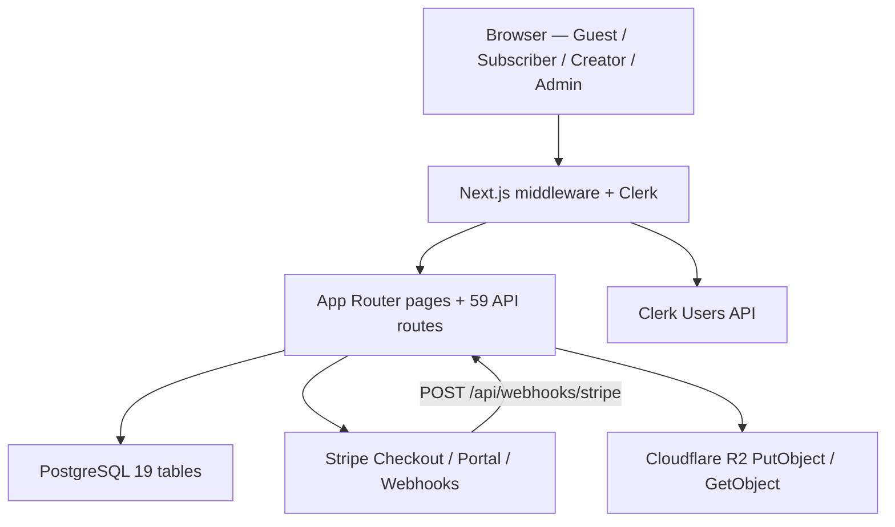
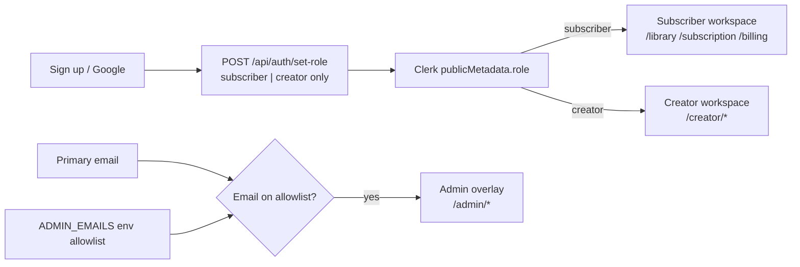
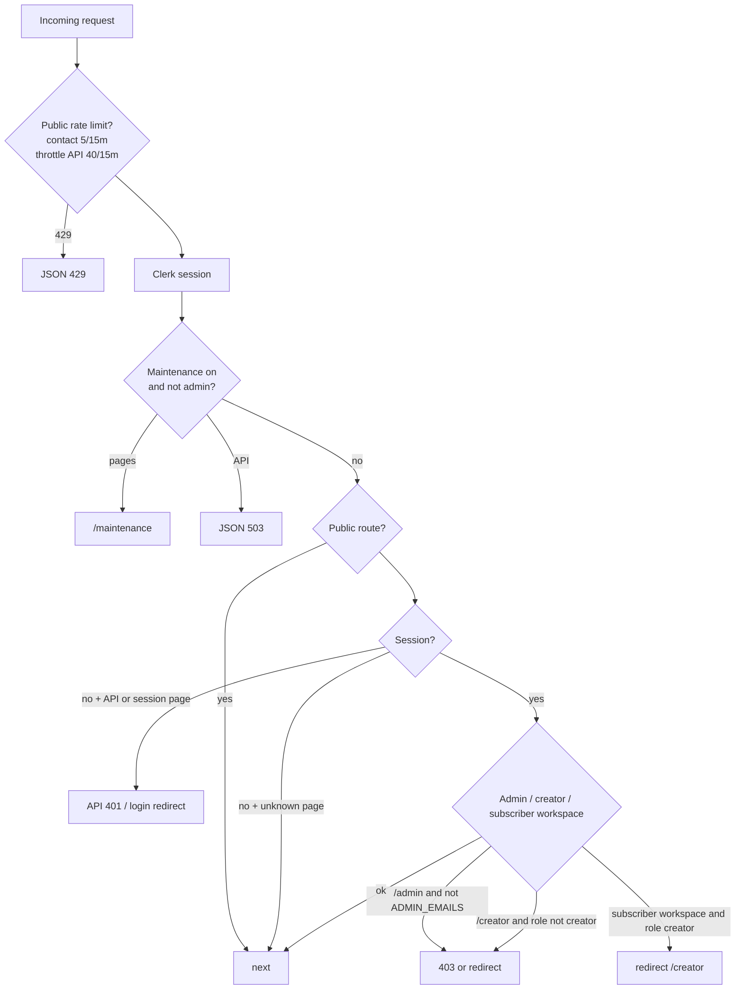
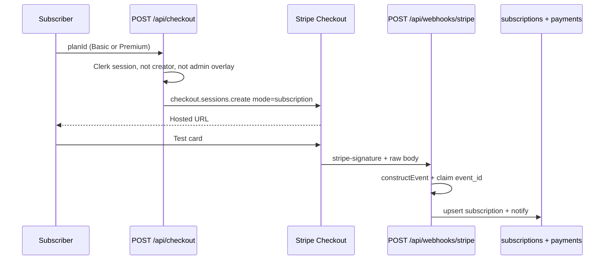
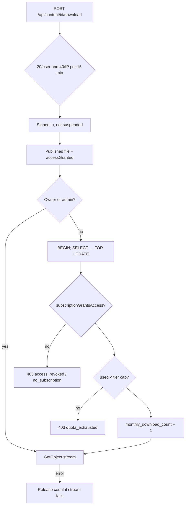
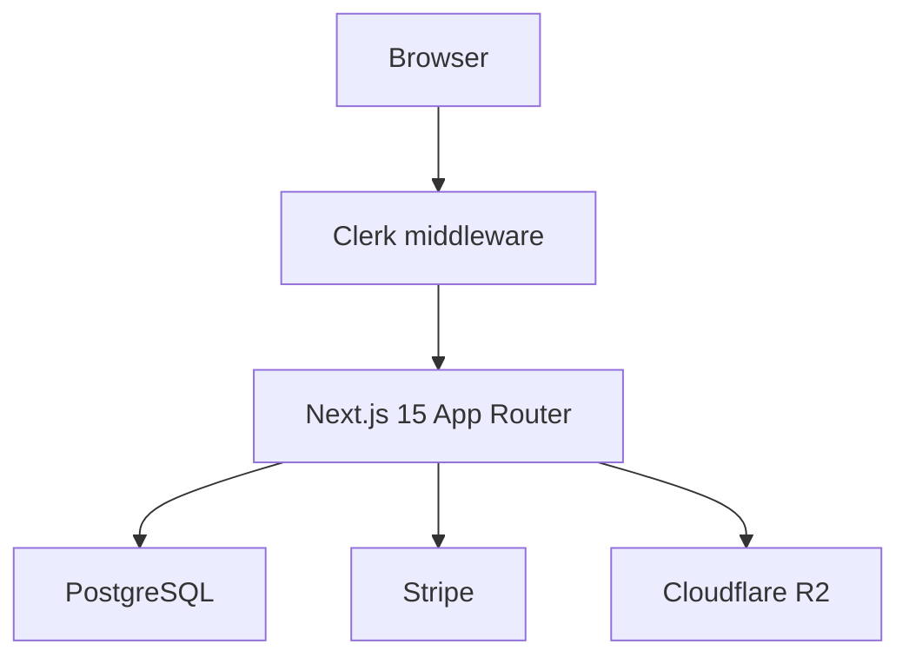
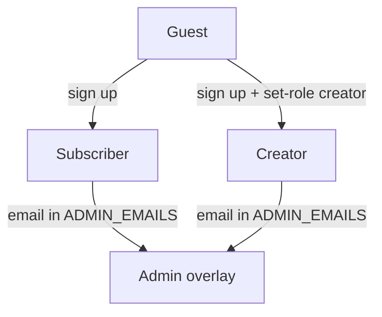
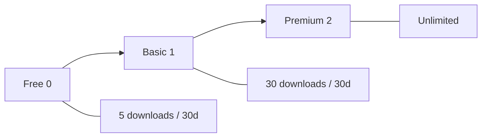

# FYP Panel Defense — Slide Data (Code-Verified)

**Product:** Advanced Subscription & Membership Platform (ASMP)  
**Author:** Raja Irfan Ahmed  
**Source of truth:** this repository as audited (not the Word report, not marketing copy)  
**How to use:** copy each **Slide N** block into PowerPoint. Paste mermaid into [mermaid.live](https://mermaid.live) and export PNG if the slide needs a diagram.  
**Do not rename the product Nexora.**

---

## Honest claims vs do-not-claim

| Claim | Code verdict | Evidence |
|---|---|---|
| Admin is gated by `ADMIN_EMAILS` | **True. Still the only admin gate.** | `src/lib/auth/roles.ts`, `src/middleware.ts`, `src/lib/auth/require-admin.ts` |
| Admin is a Clerk signup option | **False.** Signup only stores `subscriber` or `creator`. | `src/app/api/auth/set-role/route.ts` never accepts `"admin"` |
| “Email oracle” (`GET /api/auth/check-admin?email=…`) | **Removed.** Route is **session-only**. Query-string emails are ignored. | `src/app/api/auth/check-admin/route.ts` — `GET()` takes no request URL/email |
| Admin checks are “session-only and never re-read `ADMIN_EMAILS`” | **False.** Session proves *who* you are. `ADMIN_EMAILS` still decides *whether* you are admin. | Middleware + `requireAdminContext()` both call `isAdminEmail` |
| PostgreSQL Row Level Security (RLS) | **Not in this codebase.** No `ENABLE ROW LEVEL SECURITY`, no `CREATE POLICY`. | `scripts/postgres/schema.sql` |
| Ownership is application-level | **True.** Queries filter by Clerk user id / creator id. | Content, plans, downloads, playback |
| Database is MongoDB at runtime | **False.** PostgreSQL via `DATABASE_URL`. Folder `src/lib/mongodb/` is a compatibility name. | `src/lib/db/pool.ts`, `src/lib/mongodb/pg-adapter.ts` |
| Stripe Connect / creator payouts / platform commission on charges | **Not implemented.** Checkout charges the **platform** Stripe account. | README + `src/app/pricing/page.tsx` FAQ; no Connect APIs |
| Rate limiter is distributed (Redis) | **False.** Process-local in-memory sliding window. | `src/lib/security/rate-limit.ts` |

---

## Four roles (as the live demo actually behaves)

Clerk `publicMetadata.role` is only `subscriber` | `creator`.  
**Admin is an overlay:** same login, email listed in `ADMIN_EMAILS`.

| Role | How you become it | Home after login | Cannot do |
|---|---|---|---|
| **Guest** | Not signed in | Public pages | Any `/api/*` except the public allowlist; session pages (`/library`, `/subscription`, `/billing`, `/account`, `/creator`, `/admin`) |
| **Subscriber** | Sign up → set-role `subscriber` (default) | `/library` | Creator APIs, `/admin`, Follow/Checkout if the viewer is a creator |
| **Creator** | Sign up → set-role `creator` | `/creator` | Subscriber checkout/Follow; `/admin` unless also on `ADMIN_EMAILS` |
| **Admin** | Email in `ADMIN_EMAILS` (env, comma-separated, lowercased) | `/admin` | Cannot *self-target* some admin mutations; cannot modify another admin from the users screen (`assertNotAdminTarget`) |

---

## Project objectives → where the code is

From `docs/project objectives.jpeg`:

| Objective | Live proof | Primary files |
|---|---|---|
| Multi-tier plans + recurring payments | Free / Basic / Premium per creator; Stripe Checkout `mode: "subscription"`; monthly cycle enum | `src/config/default-plans.ts`, `src/lib/stripe/checkout.ts`, `scripts/postgres/schema.sql` (`billing_cycle = monthly`) |
| Content access by subscription | Rank Free=0, Basic=1, Premium=2; playback/download gated | `src/lib/membership/access.ts`, `src/lib/mongodb/content.ts` `getGuardedPublishedContent` |
| Automated renewal notifications | Stripe `invoice.upcoming` + cron sweep (default 7-day lead, 1–30) | `src/lib/stripe/webhook.ts`, `src/lib/mongodb/renewal-reminders.ts`, `src/app/api/cron/renewal-reminders/route.ts` |
| Analytics dashboard | Admin `/admin/analytics`; creator `/creator/analytics`; daily rollup cron | `src/lib/mongodb/analytics-rollup.ts`, `src/app/api/cron/analytics/daily-rollup/route.ts` |

---

# SLIDE DECK

---

## Slide 1 — Title

**Title:** Advanced Subscription & Membership Platform  
**Subtitle:** Final Year Project — Panel Defense  
**One line:** Per-creator digital memberships with Clerk auth, PostgreSQL, Stripe Checkout, and Cloudflare R2.

**Speaker notes:** Name the stack once. Do not call it a marketplace or a Connect payout product.

**Live demo hook:** Open `http://localhost:3000` (or `NEXT_PUBLIC_APP_URL`).

---

## Slide 2 — Problem and idea

**Title:** What the platform is

**Bullets (from the assigned idea, implemented as code):**

- Creators publish **video, articles, and files** (PDF / ZIP / RAR).
- Subscribers **follow a creator for free**, or pay **that creator** for Basic or Premium.
- Access is **per (subscriber, creator) pair**, not one site-wide plan.
- Recurring billing is **monthly** Stripe subscriptions on the **platform** Stripe account.

**Do not say:** “creators get Stripe Connect payouts” or “the platform takes a cut of each charge.” `platform_fee_bps` exists on `platform_settings` as a stored number (default 10000 = 100%) but Checkout does **not** split funds to connected accounts.

---

## Slide 3 — Objectives (mapped)

**Title:** Objectives → implemented behavior

| # | Objective | Demo sentence |
|---|---|---|
| 1 | Multi-tier + recurring pay | “This creator’s Basic is $19/mo, Premium $49/mo. Subscribe opens Stripe Checkout.” Default prices: `src/config/default-plans.ts`. |
| 2 | Access restrictions | “Free content plays; Basic video 403s until Checkout succeeds.” Rank check in `subscriptionMeetsContent`. |
| 3 | Renewal reminders | “Stripe `invoice.upcoming` and `/api/cron/renewal-reminders` write in-app notifications.” |
| 4 | Analytics | “Creator analytics + admin analytics; nightly rollup writes `analytics` rows.” |

---

## Slide 4 — What we built vs what we did not

**Title:** Scope (honest)

**Built:**

- Next.js **15.3.x** App Router, React **19**, TypeScript
- Clerk **v7** (email/password, Google, reset, verify)
- PostgreSQL (`pg` pool, max 10 connections)
- Stripe Checkout + Customer Portal + signed webhooks
- Cloudflare R2 via AWS S3 SDK `PutObject` (server-side, not client presign)
- **59** App Router route handlers under `src/app/api/`

**Not built (do not claim):**

- Postgres RLS
- Stripe Connect / connected accounts
- MongoDB as the runtime database
- Redis / global rate-limit cluster
- Admin as a public signup role

---

## Slide 5 — Technology stack (exact)

**Title:** Stack as shipped (`package.json` 1.0.0)

| Layer | Package / system |
|---|---|
| App | `next` ^15.3.1, `react` ^19.1.0 |
| Auth | `@clerk/nextjs` ^7.3.0 |
| Data | `pg` ^8.11.5, database name `AdvancedSubscription_MembershipPlatform` |
| Billing | `stripe` ^22.1.1 |
| Storage | `@aws-sdk/client-s3` ^3.1042.0 → Cloudflare R2 `region: "auto"` |
| UI | Tailwind CSS 4, Framer Motion, Lenis |
| Data folder name | `src/lib/mongodb/` — **PostgreSQL adapter**, not Mongo |

**Env the panel may ask about:** `DATABASE_URL`, `ADMIN_EMAILS`, `STRIPE_SECRET_KEY`, `STRIPE_WEBHOOK_SECRET`, `CLOUDFLARE_R2_*`, `CRON_SECRET`, `NEXT_PUBLIC_APP_URL`.

---

## Slide 6 — System architecture (diagram)

**Title:** Request path



**Speaker notes:** Middleware is the perimeter. Route handlers still re-check role, ownership, and (for admin) `ADMIN_EMAILS`.

---

## Slide 7 — Four roles overview (diagram)

**Title:** Identity model



**Key sentence:** “Admin is not stored as a role in Clerk. It is an environment allowlist checked on the server.”

---

## Slide 8 — Guest

**Title:** Role 1 — Guest

**Can visit (public matcher in `src/middleware.ts`):**  
`/`, `/pricing`, `/about`, `/support`, `/contact`, `/terms`, `/privacy`, `/creators`, `/creators/*`, `/locked-content`, `/login`, `/sign-up`, plus listed public APIs.

**Public APIs (explicit allowlist — never `/api/auth/(.*)` as a glob):**

- `/api/auth/me`, `/api/auth/throttle`
- `/api/system/*`, `/api/public/*`, `/api/contact`
- `/api/webhooks/*`, `/api/cron/*`

**Denied:**

- Other `/api/*` without a session → **401 JSON** `{ error, code: "UNAUTHENTICATED" }`
- Session pages → redirect `/login?redirect_url=…`

**Unknown page URLs are not forced to login** — they 404. That is intentional.

**Demo:** Open `/creators` signed out. Click a paid video → login redirect. Hit `/api/checkout` in the browser → 401 JSON.

---

## Slide 9 — Subscriber

**Title:** Role 2 — Subscriber

**Redirect after auth:** `/library` (`ROLE_REDIRECTS` in `src/lib/auth/roles.ts`).

**Can:**

- Follow a creator for **free** (`POST /api/subscriptions`) — no card.
- Pay Basic/Premium via `POST /api/checkout` → hosted Stripe Checkout.
- Watch via `GET /api/content/[id]/playback` (Range-aware R2 stream).
- Download files via `POST /api/content/[id]/download` (quota + R2 stream, `Content-Disposition: attachment`).
- Billing Portal (`/api/billing-portal`), notifications, account.

**Cannot:**

- Upload content (`POST /api/storage/upload` requires creator or admin).
- Open `/creator` or `/api/creator/*` (middleware 403 / redirect `/library`).
- Subscribe if `synced.role !== "subscriber"` or `synced.isAdmin` (`src/lib/stripe/checkout.ts`).

**Access statuses that grant consumption:** `active`, `trialing`, `past_due`.  
**Do not grant:** `canceled`, `expired`, and non-consume statuses (`incomplete`, `paused`, `unpaid` mapped in webhook).  
**Paid rows** with `currentPeriodEnd` in the past (plus 2-minute skew) are denied even if status was left `active`.

**Demo:** Sign in as subscriber → Follow (free banner) → Subscribe Basic → Stripe test card `4242…` → library unlocks.

---

## Slide 10 — Creator

**Title:** Role 3 — Creator

**Redirect:** `/creator`. Middleware blocks `/library`, `/subscription`, `/billing` for creators (not admins).

**Workspace pages:** overview, content (new/edit), plans, subscribers, revenue, analytics, settings.

**Ownership:** content and plan queries include `creatorClerkUserId: context.clerkUserId`. You cannot edit another creator’s row by guessing an id.

**Plans:**

- Auto-seeded Free / Basic $19 / Premium $49 (`DEFAULT_CREATOR_PLANS`).
- Paid price clamp **$1.00–$9,999.00**.
- Server syncs Stripe Product/Price (`syncPlanToStripe`). Missing `stripePriceId` → Checkout not ready.

**Uploads:** raw body to `/api/storage/upload?category=&fileName=` then `PutObject`. Caps: images 8 MB, video 500 MB, files 200 MB.

**Demo:** Publish a Basic video → as another user, it is locked until Basic Checkout.

---

## Slide 11 — Admin

**Title:** Role 4 — Admin (`ADMIN_EMAILS`)

**How:** comma-separated emails in env, trimmed, lowercased. Not `NEXT_PUBLIC_`. Users still log in at `/login`.

**Gates (all three fire):**

1. Middleware: `/admin` and `/api/admin/*` require `adminEmails.includes(email)`.
2. `src/app/admin/layout.tsx` calls `requireAdminContext()` (redirect `/library` if not admin).
3. Every admin API: `requireAdminContext()` (GET) or `requireAdminMutation()` (writes).

**`GET /api/auth/check-admin`:** session-only boolean for the **caller**. Not an oracle for arbitrary emails. Used by nav; **not** a substitute for (1)–(3).

**Screens:** overview, users (detail + suspend), creators, subscribers, content, plans, payments (refund/retry), subscriptions (+7d / +30d / period end / cancel now), analytics, notifications, settings (maintenance).

**Mutations:** 60 actions / 15 minutes per `admin-mutate:{clerkUserId}:{ip}`. Destructive actions need a typed confirmation phrase (e.g. `CANCEL NOW`, account email).

**Fail-closed Stripe:** if the subscription has `stripeSubscriptionId` and Stripe cancel fails, the **local row is not changed** (502).

**Demo:** Non-admin URL `/admin` → bounced to `/library` or `/creator`. Admin email → dashboard. Suspend a subscriber → their download/checkout 403s.

---

## Slide 12 — Middleware perimeter (diagram)

**Title:** `src/middleware.ts`



**Redirects after hitting `/login` while already signed in:** admin → `/admin`, creator → `/creator`, else `/library`.

---

## Slide 13 — Admin gating and the removed email oracle

**Title:** How admin is decided (panel-critical)

**Still true:**

```
ADMIN_EMAILS=you@university.edu,other@uni.edu
isAdminEmail(email) → includes(trim(lower(email)))
```

**Removed (do not demo as if it still works):** probing `GET /api/auth/check-admin?email=victim@x.com` to learn who is admin. The handler:

- Requires Clerk `userId` or returns **401**
- Reads **the session user’s** email via `resolveClerkSessionUser()`
- Returns `{ isAdmin: boolean }` with `Cache-Control: no-store`
- Comment in source: *“Query-string emails are ignored — this must never be an allowlist oracle.”*

**If asked “is admin session-only?”**  
Answer: “The *identity* is the Clerk session. The *authorization* is still `ADMIN_EMAILS` on the server. We closed the hole where anyone could ask the API about *someone else’s* email.”

**If asked “Postgres RLS?”**  
Answer: “No. Isolation is application queries plus unique indexes, not database RLS policies.”

---

## Slide 14 — Rate limiting (exact numbers)

**Title:** Sliding-window limiter (`src/lib/security/rate-limit.ts`)

**Implementation:** in-memory `Map` of timestamps. Per Node isolate. Sweeps idle keys. Headers: `X-RateLimit-Limit`, `X-RateLimit-Remaining`, `Retry-After`.

| Key | Limit | Window | Where |
|---|---|---|---|
| `contact:{ip}` | 5 | 15 min | Middleware POST `/api/contact` **and** the contact route |
| `throttle:{ip}` | 40 | 15 min | Middleware POST `/api/auth/throttle` |
| `auth:login:{ip}` | 8 | 15 min | `/api/auth/throttle` action `login` |
| `auth:register:{ip}` | 5 | 15 min | action `register` |
| `auth:forgot-password:{ip}` | 3 | 15 min | action `forgot-password` |
| `admin-mutate:{userId}:{ip}` | 60 | 15 min | `requireAdminMutation` |
| `download:{userId}` | 20 | 15 min | download route |
| `download:{ip}` | 40 | 15 min | download route |
| `view:{ip}:{contentId}` | 8 | 60 min | view route |
| `view:{ip}` | 40 | 15 min | view route |

**Login forms must call throttle before Clerk** so stuffing is bounded at the app, then Clerk’s own throttling still applies.

**Honest limit:** restarting the Next process resets counters; multiple instances do not share the map.

---

## Slide 15 — Membership model

**Title:** One membership per creator

**Ranks** (`PLAN_TIER_RANK`): Free 0 < Basic 1 < Premium 2.

**Uniqueness:**

- `UNIQUE (subscriber_profile_id, creator_profile_id)`
- Unique index `idx_subscriptions_clerk_pair` on `(subscriber_clerk_user_id, creator_clerk_user_id)`

**Tiers** (`src/config/tier-limits.ts` — single source of truth):

| Tier | How | Content | Downloads / creator / 30 days |
|---|---|---|---|
| Free | Follow, no card | That creator’s Free items | 5 |
| Basic | Stripe Checkout | Free + Basic | 30 |
| Premium | Stripe Checkout | Entire catalog of that creator | Unlimited (`Number.POSITIVE_INFINITY` → JSON `null`) |

**Quota window:** `QUOTA_WINDOW_MS = 30 days`.  
**Paid plan price:** min **$1**, max **$9999**.

**Checkout rule (current code):** Free → paid **always** opens hosted Checkout. In-place Stripe price update (`applied: true`, skip Checkout) only if the **local** membership is already a live paid tier.

---

## Slide 16 — Stripe billing (diagram)

**Title:** Recurring payments



**Webhook events handled** (`handleStripeWebhookEvent`):

- `checkout.session.completed`
- `customer.subscription.created` / `updated` / `deleted`
- `invoice.upcoming` (renewal reminder)
- `invoice.paid` / `invoice.payment_succeeded`
- `invoice.payment_failed`

Unknown types: HTTP 200, no-op (so the Stripe dashboard stays green).

**Signature:** raw `req.text()` + `stripe.webhooks.constructEvent`. Missing `STRIPE_WEBHOOK_SECRET` → 503. Bad signature → 400.

**Idempotency:** table `stripe_webhook_events` (`event_id` PK). Duplicate → `{ received: true, duplicate: true }`. Handler error → event released so Stripe can retry; handler is upsert-based.

**Success-page race:** `confirmCheckoutSessionForUser` replays the session if the webhook is late, and **rejects** if `metadata.subscriberClerkUserId !==` the logged-in user.

**No Connect.** Charges hit the platform Stripe account.

---

## Slide 17 — Content access and ownership

**Title:** Application-level authorization

**Library / playback / download** (`getGuardedPublishedContent`):

1. Content must be `status: "published"`.
2. Admin email → access granted.
3. Suspended viewer (non-admin) → deny `viewer_blocked`.
4. Suspended creator → deny `creator_blocked` (“not accepting members”).
5. Owner (`userId === creatorClerkUserId`) or `requiredPlan === "free"` → grant.
6. Else live subscription for **that** creator, `subscriptionGrantsAccess` + rank ≥ required.

**Media URLs are not sent to the client.** `redactSubscriberMedia` clears `videoUrl`, `videoKey`, `fileUrl`, `fileKey`, `thumbnailKey`, `externalVideoUrl`. Article body only if granted. Bytes go through:

- `GET /api/content/[id]/playback` (video; YouTube/Vimeo HTTPS allowlist for external)
- `POST /api/content/[id]/download` (files)

**Creator writes:** `findOne({ _id, creatorClerkUserId: context.clerkUserId })`.

**R2 key ownership:** `storageKeyBelongsToUser(key, clerkUserId)` — key path must contain that user’s sanitized Clerk id; `..` and `\` rejected.

**This is not RLS.** Same DB role serves all queries; the app attaches `WHERE` / document filters.

---

## Slide 18 — Cloudflare R2

**Title:** Object storage

**Upload path:** browser → **authenticated** `POST /api/storage/upload` (creator or admin) → server buffers body → `PutObject` with explicit `ContentLength`. **No client presigned PUT.**

**Env:** `CLOUDFLARE_R2_ACCOUNT_ID`, `ACCESS_KEY_ID`, `SECRET_ACCESS_KEY`, `BUCKET_NAME`, `CLOUDFLARE_R2_PUBLIC_URL`.

**Key layout:** `{prefix}/{clerkUserId}/{date}/{uuid}.ext`  
Prefixes: `avatars/profiles`, `avatars/creators`, `banners/creators`, `thumbnails/videos`, `thumbnails/articles`, `covers/files`, `content/videos`, `content/downloads`.

**Limits:**

| Category | Max | Types |
|---|---|---|
| Images (avatar/banner/thumb/cover) | 8 MB | jpeg/png/webp/gif (as in `STORAGE_FILE_RULES`) |
| Video | 500 MB | mp4 / mov / webm |
| Downloadable | 200 MB | pdf / zip / rar |

**Playback:** `GetObject` with HTTP `Range`.  
**Download:** stream as `application/octet-stream` attachment (does not open PDF in the tab).  
**Upload route `maxDuration`:** 300 seconds.

---

## Slide 19 — Download quotas (diagram)

**Title:** Per-creator monthly quota



**Headers on success:** `X-Download-Quota-Remaining`, `X-Download-Quota-Limit`, `X-Download-Quota-Access-Level`, `X-Download-Quota-Window-End`.

**SQL lock:** `FOR UPDATE OF s` on the `(subscriber_clerk_user_id, creator_clerk_user_id)` row — two parallel downloads cannot both pass the cap.

**Owner/admin skip quota.** Free follow with no row: route may auto-create free follow then consume (5/month).

---

## Slide 20 — Notifications and cron

**Title:** Automated reminders (objective 3)

**In-app inbox** table `notifications`. Categories include `renewal`, `payment`, `content`, `account`, `creator`, `system`.

**Renewal:**

1. Stripe event `invoice.upcoming` → `sendUpcomingInvoiceReminder`.
2. Cron `GET/POST /api/cron/renewal-reminders` with `CRON_SECRET` (`Authorization: Bearer` or, in non-production only, `?secret=`).
3. Lead days from `platform_settings.renewalReminderLeadDays`, clamped **1–30**, default **7**.
4. Skips free, `cancelAtPeriodEnd`, blocked accounts; dedupes with `reminderKey`.

**Analytics cron:** `/api/cron/analytics/daily-rollup` — same `CRON_SECRET`. Writes per-creator daily snapshot: subscribers, paid, revenue cents, views, downloads, churn.

**If `CRON_SECRET` unset:** cron routes refuse with 401.

---

## Slide 21 — Analytics (objective 4)

**Title:** Engagement dashboards

**Creator `/creator/analytics`:** content split, subscriber/download stats from `creator-stats`.

**Admin `/admin/analytics`:** platform aggregates in `admin-stats.ts`.

**Daily rollup fields** (`AnalyticsRollupSnapshot`): `totalSubscribers`, `activeSubscribers`, `paidSubscribers`, `totalRevenueCents`, `monthlyRecurringCents`, `totalViews`, `totalDownloads`, `contentCount`, `newSubscribersToday`, `churnedSubscribersToday`. Unique `(creator_profile_id, snapshot_date)`.

**View counting** is rate-limited (`view:` keys) so a refresh loop does not inflate engagement unbounded.

---

## Slide 22 — PostgreSQL schema (no RLS)

**Title:** Data model (`scripts/postgres/schema.sql`)

**19 tables** created in schema (including helpers):  
`migration_quarantine`, `user_profiles`, `creator_profiles`, `creator_workspace_alerts`, `creator_workspace_defaults`, `subscriber_profiles`, `subscriber_notification_preferences`, `subscriber_preferred_content_types`, `plans`, `plan_features`, `content`, `subscriptions`, `payments`, `notifications`, `analytics`, `contacts`, `platform_settings`, `stripe_webhook_events`, `admin_audit_events`.

**Enums worth quoting:**  
`user_role: subscriber | creator` (no admin enum)  
`access_level: free | basic | premium`  
`subscription_status: active | trialing | past_due | canceled | expired`  
`billing_cycle: monthly` only.

**Integrity the panel can hear:** unique membership pair, unique Stripe invoice id (partial), webhook `event_id` PK, admin audit log (actor, ip, payload).

**Pool:** `new Pool({ connectionString: DATABASE_URL, max: 10 })`.

---

## Slide 23 — Security summary (say only this)

**Title:** Security controls that exist in code

1. Clerk session on protected APIs; guests get 401 JSON, not an HTML login dump.
2. Admin = `ADMIN_EMAILS`; check-admin is not an email oracle.
3. Set-role cannot write `admin`.
4. Process-local rate limits on auth, contact, download, views, admin writes.
5. Stripe webhook signature + claimed event ids.
6. Cron bearer secret.
7. Ownership filters + R2 key prefix check.
8. Media URLs stripped from JSON; playback/download are gated streams.
9. Suspended accounts blocked on checkout, download, upload, playback (admin exempt).
10. Admin Stripe actions fail closed.

**Do not add:** “database RLS”, “zero-trust mesh”, “PCI we store cards” (Stripe hosted Checkout; we do not store PAN).

---

## Slide 24 — Live demo script (by role)

**Title:** Demo order (matches the slides)

| Step | Role | Action | Expected |
|---|---|---|---|
| 1 | Guest | `/creators` | Catalog of **published** creators only |
| 2 | Guest | Open paid item | Login with `redirect_url` |
| 3 | Subscriber | Follow | Instant Free membership, no Stripe |
| 4 | Subscriber | Basic Subscribe | Redirect to `checkout.stripe.com` (not an in-app “already Basic” toast) |
| 5 | Subscriber | Pay test card | Webhook or success-page confirm → Basic access |
| 6 | Subscriber | Play Basic video | `/api/content/…/playback` 200; URL not in page JSON |
| 7 | Subscriber | Download file | Attachment + quota headers |
| 8 | Creator | Plans / content | Own rows only; Stripe price ids on paid plans |
| 9 | Admin | `/admin` with allowlisted email | Dashboard |
| 10 | Non-admin | `/admin` | Redirect away |
| 11 | Admin | Maintenance on | Public → `/maintenance`; admin still in |
| 12 | Admin | +7d / Period end / Cancel now | Extend local period, or Stripe cancel at period end / immediately (typed phrase) |

**Local webhook:** `stripe listen --forward-to localhost:3000/api/webhooks/stripe` and paste `STRIPE_WEBHOOK_SECRET`.

---

## Slide 25 — Limitations (if asked)

**Title:** Known boundaries

- Rate limits are **per process**, not Redis.
- Folder name `mongodb` is historical; runtime is PostgreSQL.
- No Stripe Connect — creators do not receive automatic payouts.
- No Postgres RLS — rely on application filters.
- Admin power is as strong as whoever can edit the server env (`ADMIN_EMAILS`).
- Maintenance check fetches `/api/system/maintenance` with 30s revalidate.
- Checkout `applied: true` is only for **paid → higher paid** with a live local Stripe subscription id — Free → paid always Checkout.

---

# APPENDIX A — File map for rapid answers

| Topic | Path |
|---|---|
| Admin emails | `src/lib/auth/roles.ts` |
| requireAdmin | `src/lib/auth/require-admin.ts` |
| check-admin (no oracle) | `src/app/api/auth/check-admin/route.ts` |
| set-role | `src/app/api/auth/set-role/route.ts` |
| Middleware | `src/middleware.ts` |
| Rate limit | `src/lib/security/rate-limit.ts` |
| Throttle numbers | `src/app/api/auth/throttle/route.ts` |
| Access ranks / consume | `src/lib/membership/access.ts` |
| Tier quotas | `src/config/tier-limits.ts` |
| Quota lock | `src/lib/mongodb/download-quota.ts` |
| Download route | `src/app/api/content/[contentId]/download/route.ts` |
| Playback | `src/app/api/content/[contentId]/playback/route.ts` |
| Content guard + redact | `src/lib/mongodb/content.ts` |
| R2 | `src/lib/storage/r2.ts`, `src/app/api/storage/upload/route.ts` |
| Checkout | `src/lib/stripe/checkout.ts`, `src/app/api/checkout/route.ts` |
| Webhook HTTP | `src/app/api/webhooks/stripe/route.ts` |
| Webhook handlers | `src/lib/stripe/webhook.ts` |
| Schema | `scripts/postgres/schema.sql` |
| Cron auth | `src/lib/security/cron-auth.ts` |
| Default plan prices | `src/config/default-plans.ts` |

---

# APPENDIX B — Copy-paste mermaid only

Use these if a slide is diagram-only. Same as slides 6, 7, 12, 16, 19.

### B1 Architecture — Slide 6



### B2 Roles — Slide 7



### B3 Access rank — optional extra slide



---

*Generated from the repository source. If a line is not in this file, do not put it on a slide.*
